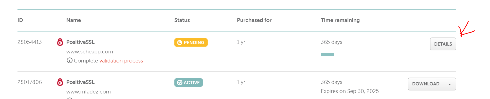
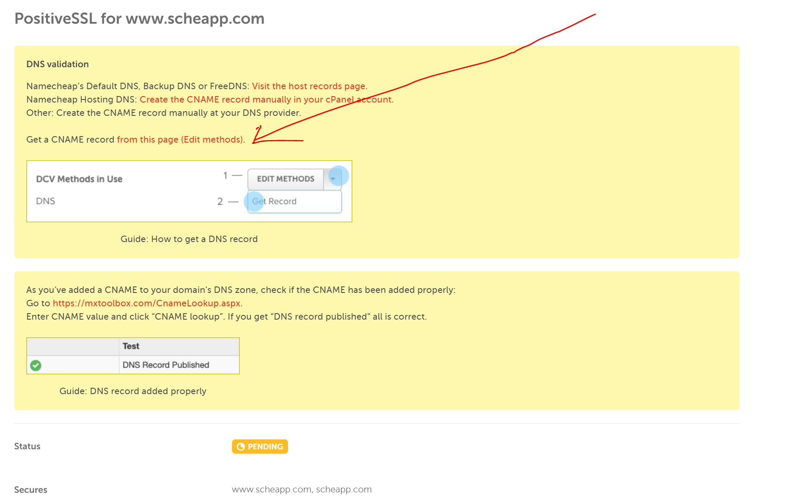
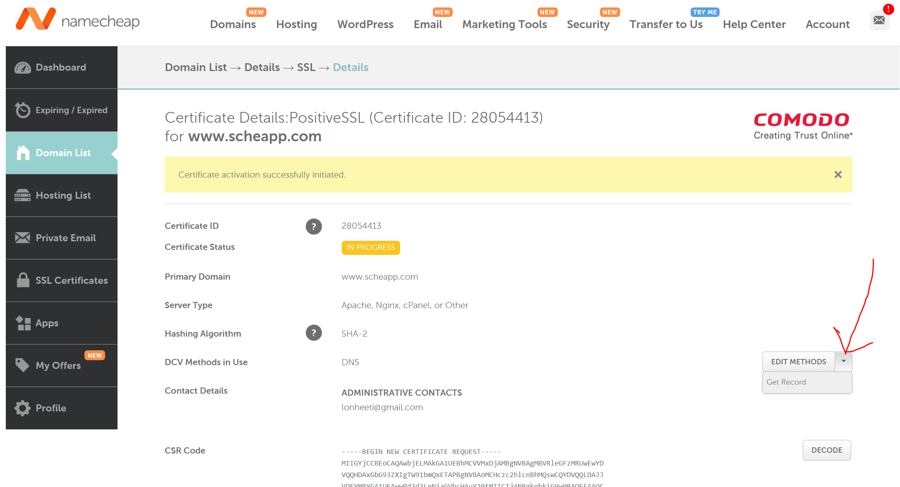
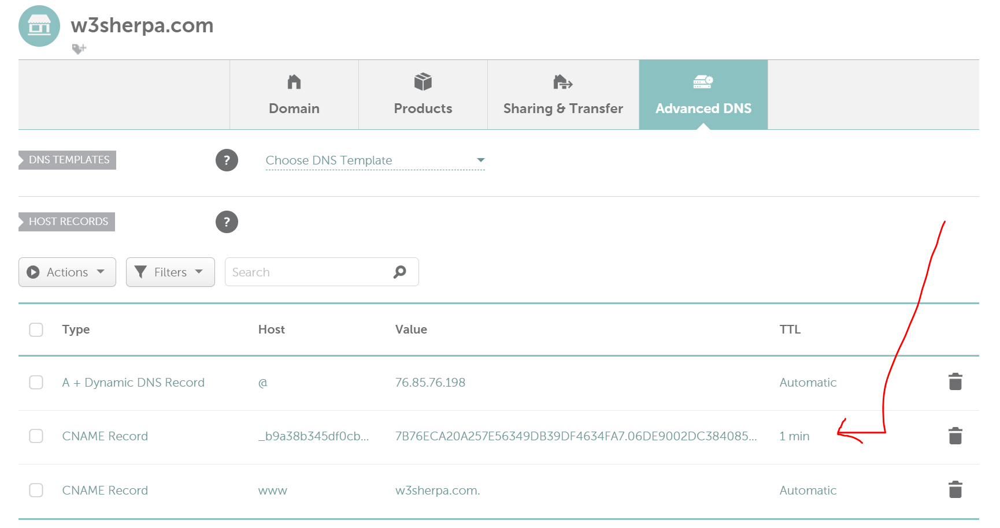
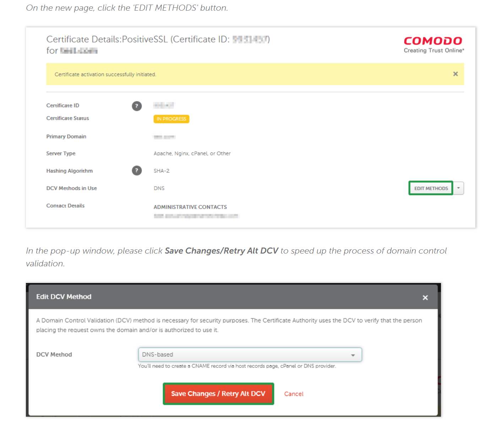
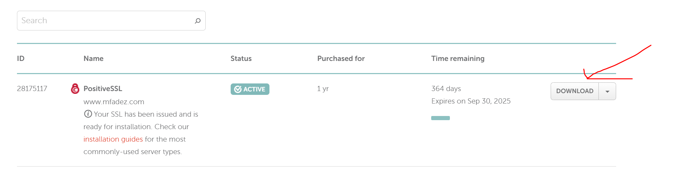
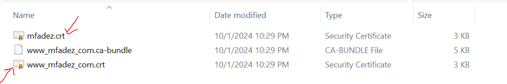
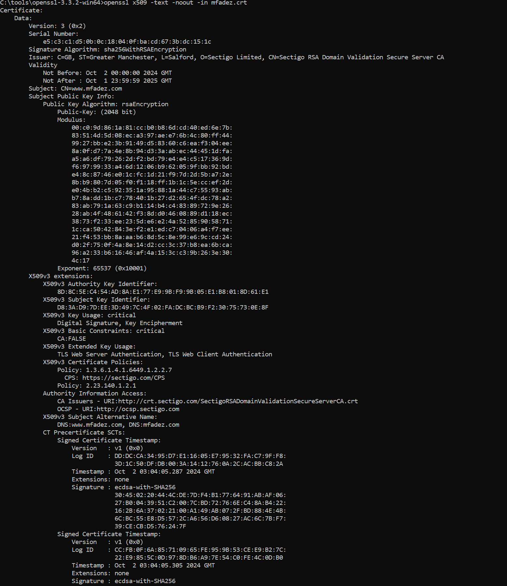

# Download openssl

# Go to OpenSSl folder and run

> `openssl req -new -newkey rsa:2048 -nodes -keyout service_name.key -out DOMAIN_NAME_csr.txt`
> Replace the service_name with the service name like w3sherpa or scheapp
> Fill in the required fields:

Country: use a valid 2-letter country-code.
State or Province: Use your state or Province name, or use the Locality name if you have none.
Locality or City: use your city, town or other locality name.
Company: use your company/organization name or put NA (Not Applicable).
Organizational Unit: use your unit or department name or put NA (Not Applicable).
Common Name: put your domain name here (i.e. www.example.com or example.com), put _.domain_name (i.e. _.example.com) if you are using a Wildcard type SSL.
Note: for ‘Email Address’, ‘challenge password’ and ‘optional company name’, simply press Enter to leave them empty, as these are the legacy fields.

# THe key and cert will be created in the openssl exe folder

# Copy the two files and save it in the c:/SSLCerts/service_name folder ( if folder is not ther create the service_name Folder)

## Log in to the namecheap and issue the cert.

Copy the service_name_csr.txt text value in the enter CSR field.

1. click on details on ssl list
   

1. Click on get cname record link
   

1. Get cname record
   

1. Add cname in advamnce dns
   

1. Do DNS Validation
   

1. Download certs from the namecheap once the dns validation is done or get it from the email you entered in the csr
   

1. Unzip the folder/extract all. Copy www*service_name_com*.crt file and past it there and rename it to just the service_name.crt
   

1. Open the service*name.crt file in notepade and also open www_service_name_com*.ca-bundle file. Copy the content of bunder file and paste in at the botton of service_name.crt file.
   this is basically creating chained/ combined crt file.

1. To check if chained file is good, copy the service_name.crt file to openssl folder and run
   openssl x509 -text -noout -in service_name.crt

1. following should be displayed
   

1. Copy the chained service_name.crt cert to c:/SSLCerts/service_name folder
1. Create MoveToService folder inside c:/SSLCerts/service_name and copy service_name.key and chained service_name.crt files

1. Ssh to web server
   Run
   `sudo mkdir /etc/nginx/ssl/service_name`
   `sudo chmod -R 777 /etc/nginx/ssl/service_name`

1. Form local windows, open power shell and run (make sure to replace service_name)
   `scp -rp C:/SSLCerts/sherpaticket.com/MoveToServer/* websherpa@192.168.1.19:/etc/nginx/ssl/service_name`

1. On nginx server
   `sudo nano /etc/nginx/sites-enabled/apps.conf` to add server block for ssl config
