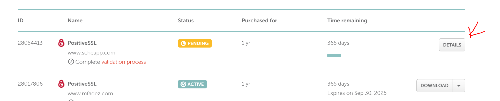
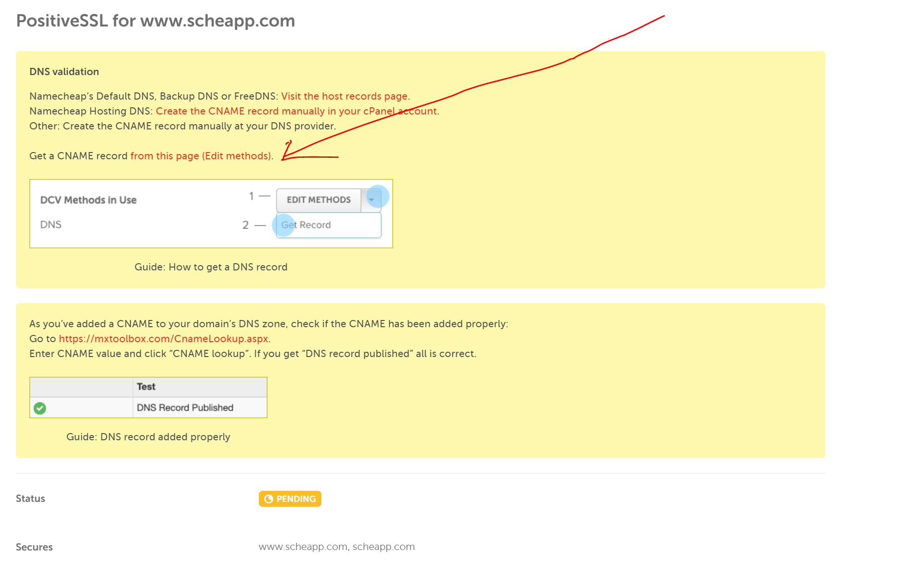
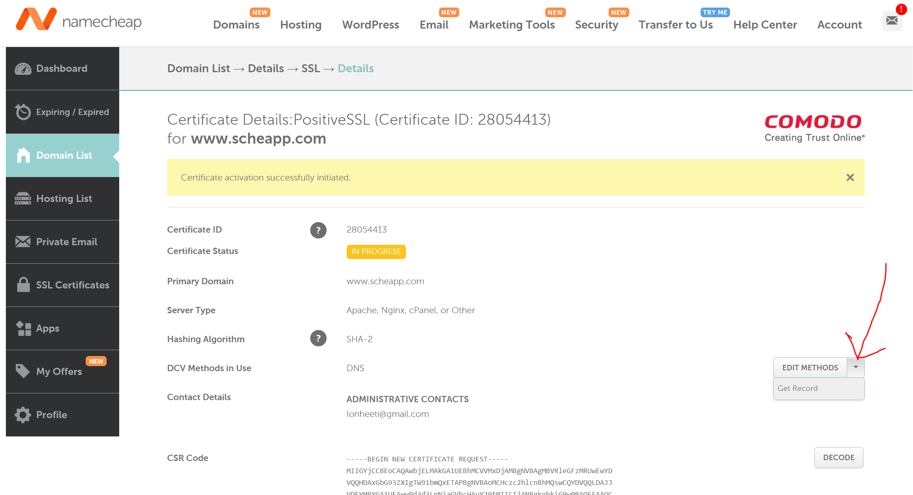
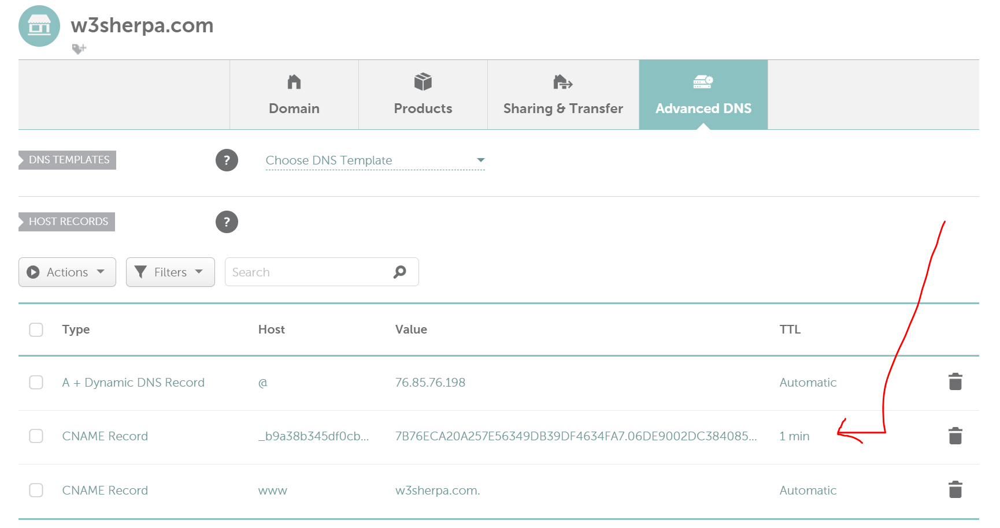

1. Open IIS
1. Goto Server certificates
1. Go to Action tab on top right and click on `Create Certificate Request`
>Enter the form fields value  
Make sure to user www.sherpaticket.com for Common name and use redirece in name cheap for sherpaticet.com
`Certificates are specific to the Common Name that they have been issued to at the Host level.
The Common Name must be the same as the Web address you access when connecting to a secure site.
For example, a Server ID for the domain "digicert.com" will receive a warning if accessing a site named "www.digicert.com" or "knowledge.digicert.com" because "www.digicert.com" and "knowledge.digicert.com" are different from the Common Name, "digicert.com".
In this case, you must create a CSR for the correct Common Name to resolve the problem.
`

1. click on details on ssl list

1. Click on get cname record link

1. Get cname record

1. Add cname in advamnce dns

1. Go to namecheap site, got to Dashboard under Accounts link.
1. Go to SSL Certificates link on left panel.
1. Go to details and download the ssl certs
1. Use the follow command to combine the certs in to chain.crt
>`cat www_sherpaticket_com.crt > www_sherpaticket_com_chain.crt ; echo >> www_sherpaticket_com_chain.crt ; cat www_sherpaticket_com.ca-bundle >> www_sherpaticket_com_chain.crt`
1. Make sure to use sudo nano to create crt files in ubuntu and then copy paste the certs content from local pc. scp does not work!!